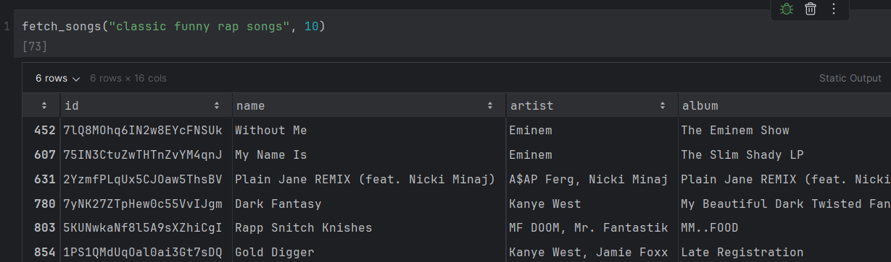
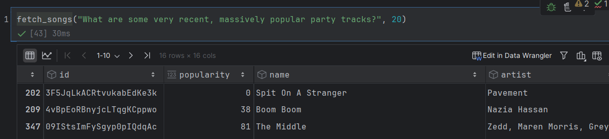

# VibeQ

**Vibe-based song retrieval that actually works...kinda**

## What’s the point?

My playlists are bloated. I know it. You know it. Every streaming platform's "For You" tab knows it. But finding those few songs that matches the vibe you’re going for in the moment? That still somehow feels like digging for a vinyl in a landfill.

VibeQ fixes that—by letting you _describe_ the mood you're in and getting songs that actually match it. No genre filters. No pre-made mood playlists. Just vector math and precision.

**Tech Stack & Tools:**
- Python
- Pandas (data manipulation)
- HuggingFace Transformers (embedding models)
- ChromaDB (vector storage and similarity search)
- Matplotlib, Seaborn (data visualization)
- Gradio – fast interface for models
- Spotify Web API (limited use for metadata collection)

**Concepts Learned & Applied:**
- Embedding-based semantic search
- Vector space modeling
- Transformer architectures (esp. contextual embeddings)
- Data cleaning, filtering, and representation tradeoffs
- UI prototyping with Gradio

## How it works

VibeQ doesn’t just dump Spotify data into some clustering algorithm and call it a day. Instead:

- I built a semantic vector search system from the ground up.
    
- Songs are represented as custom embeddings based on detailed descriptions of their _mood_, _energy_, _tone_, and _feel_—generated once and refined, made from my own playlists since everyone else has trash music taste.
    
- Those embeddings are stored and indexed using **Chroma**—a lightweight, fast vector database that allows similarity search at scale.
    
- At query time, your search phrase is converted into a vector using the same embedding model, and similarity is measured using cosine distance to return the closest matching songs.

- This ends us up with something like:

## Tech Stack

- **Custom embedding generation** pipeline using transformer-based models.
    
- **Chroma** for vector DB and similarity indexing.
    
- **Pandas** for metadata wrangling and prep.
    
- **Matplotlib + Seaborn** for occasional sanity checks on clusters and distributions.
    

No magic. Just math, models, and a lot of trial and error.

## The Problem with Metadata

Spotify's API stopped giving useful features like valence/danceability of a song since last year. So instead of relying on shallow numbers, I shifted to a text-based system that captures _vibe_ better than any scalar ever could.

Later on I tried to make genre, popularity, and recency a part of the descriptions to improve the semantic analyzer, but as you can see through the painful comments in my notebooks, I failed miserably. Results were mixed—too much conflicting info in the same vector space made everything ambiguous and vague.

As you can see here how asking for "recent", "massively popular" and "party" tracks somehow made the vector search return a laidback song from 1999 with 0 popularity. Don't get me wrong the song's good (its in my playlist of course its good), but it does not match the query at all.

So, I got rid of that kept what worked, and built on that.
## How to Use

Feed in a vibe. Get a list of songs that match it. That’s it.

## Status

It’s functional-ish. It’s fast. It’s good enough that I actually use it.

### Try it out
I put together a minimal Gradio UI so you can test VibeQ without touching code. Just enter a mood or vibe you're feeling, and it'll return matching tracks from the vector database... hopefully.

Oh and don't worry if too many Kanye West songs are returned, that isn't a bad vector search or dataset, that's just pretty much all I consume.

**👉 Try the demo here**: https://huggingface.co/spaces/molarmuaz/vibeq 
